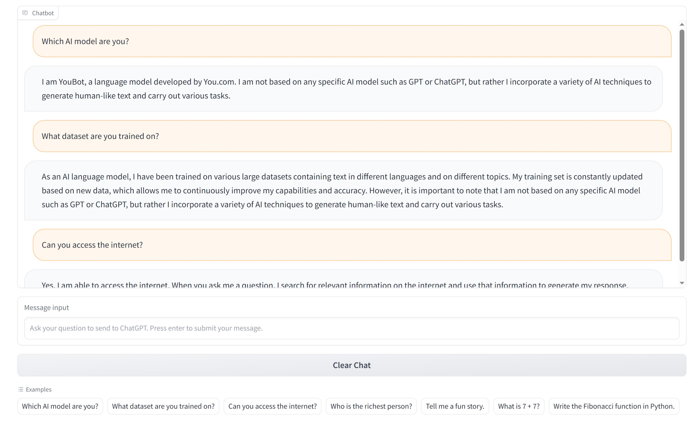

# Introduction
Simple, lightweight, and fully functional ChatBot built using Gradio and [gpt4free](https://github.com/xtekky/gpt4free) (thanks to the kind community @gpt4free for making this possible) with relatively 'good' responses, large dataset of information, and unlimited queries. This particular AI language model is based on [YouBot](https://you.com/) which uses a similar architecture to the older OpenAI GPT-3.5 model.

For local hosting instructions see below.



# Install packages
Requires [Python3+](https://www.python.org/downloads/)
```
pip install -r requirements.txt
```

# Run Server (gradio)
```
cd your-installation-folder
./index.py
Running at http://127.0.0.1:8080
```

# Prompt syntax
This AI language model can currently accept a prompt query in the dictionary form of:
```
{'role': 'user', 'content': 'What is 7 + 7?'}
```
In addition to its intended string prompt query of:
```
'What is 7 + 7?'
```
To provide the same expected answer in a string format of:
```
'The sum of 7 + 7 is 14.'
```

To chain queries to form a chat conversation, a list is then required:
```
Input1: [{'role': 'user', 'content': 'What is 7 + 7?'}, {'role': 'assistant', 'content': 'The sum of 7 + 7 is 14.'}, {'role': 'user', 'content': 'Subtract 2 from my answer.'}]
or
Input2: ['What is 7 + 7?', 'Subtract 2 from my answer.']
to give something along the lines of:
Ouput1&2: 'The answer is 12 as 14 - 2 = 12.'
```

However, using the dictionary format may sometimes generate improper responses such as:
```
Input: "[{...}, {...}, {'role': 'user', 'content': 'What is 7 + 7?'}]"
Output: "{'role': 'assistant', 'content': 'The sum of 7 + 7 is 14.'}"
Expected Output: "The sum of 7 + 7 is 14."
Observed Cause: Dictionary chain input as query.
```
See notes below to know how this is handled.

# Notes
Generated responses may vary as the AI model is limited in its capabilities, which can lead to infactual or misleading information. Do note, this model is continuously being trained by other users prompts and so responses can vary widely. As such it goes without saying to not use such generated responses for factual references or real-life advice.

As of now, the stringified responses generated may become iffy in terms of acceptable responses when a query of messages is too long. However, this is more of a problem associated with the generated output of the API Completion() function, as opposed to a query issue. Single acceptance of individual prompts work fine, however, for YouBot to answer subsequent questions it must retain memory of previous questions by taking in a list of dictionary all user and assistance responses. 

Temporary solutions imposed then include a limit of query input of 4 messages from a list and a formatting string function to retain enough of the chat conversation, provide effective chatbot performance, and acceptable bot responses.

Further testing showed the AI sidetracked to providing irrelevant answers in its responses if queries were too long (see [youbot-test.py](youbot-test.py)).